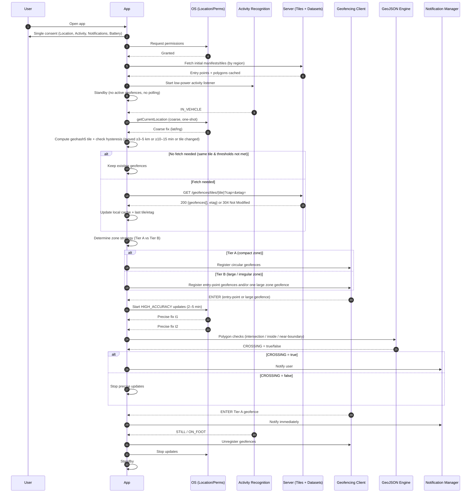

```mermaid
sequenceDiagram
autonumber
participant U as User
participant A as App
participant OS as OS (Location/Perms)
participant AR as Activity Recognition
participant S as Server (Tiles + Datasets)
participant G as Geofencing Client
participant GJ as GeoJSON Engine
participant N as Notification Manager

U->>A: Open app
A->>U: Single consent (Location, Activity, Notifications, Battery)
A->>OS: Request permissions
OS-->>A: Granted
A->>S: Fetch initial manifests/tiles (by region)
S-->>A: Entry points + polygons cached
A->>AR: Start low-power activity listener
A->>A: Standby (no active geofences, no polling)

AR-->>A: IN_VEHICLE
A->>OS: getCurrentLocation (coarse, one-shot)
OS-->>A: Coarse fix (lat/lng)

A->>A: Compute geohash5 tile + check hysteresis (moved ≥3–5 km or ≥10–15 min or tile changed)

alt No fetch needed (same tile & thresholds not met)
A->>A: Keep existing geofences
else Fetch needed
A->>S: GET /geofences/tiles/{tile}?cap=&etag=
S-->>A: 200 {geofences[], etag} or 304 Not Modified
A->>A: Update local cache + last tile/etag
end

A->>A: Determine zone strategy (Tier A vs Tier B)

alt Tier A (compact zone)
A->>G: Register circular geofences
else Tier B (large / irregular zone)
A->>G: Register entry-point geofences and/or one large zone geofence
end

G-->>A: ENTER (entry-point or large geofence)
A->>OS: Start HIGH_ACCURACY updates (2–5 min)
OS-->>A: Precise fix t1
OS-->>A: Precise fix t2

A->>GJ: Polygon checks (intersection / inside / near-boundary)
GJ-->>A: CROSSING = true/false

alt CROSSING = true
A->>N: Notify user
else CROSSING = false
A->>A: Stop precise updates
end

G-->>A: ENTER Tier A geofence
A->>N: Notify immediately

AR-->>A: STILL / ON_FOOT
A->>G: Unregister geofences
A->>OS: Stop updates
A->>A: Standby
```

